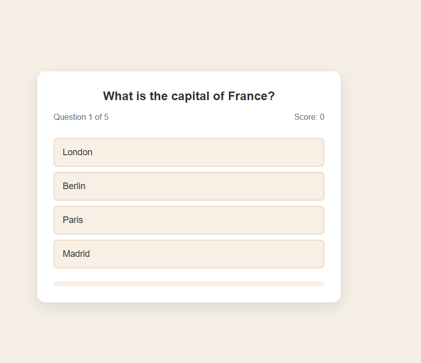

# Quiz Game

A simple quiz game built with HTML, CSS, and JavaScript.

## Live Demo
[View project online](https://devcodemate.github.io/19-mini-projects-js/)

## Features
- Multiple-choice questions
- Score tracking
- Progress bar
- Answer feedback
- Final results screen
- Restart quiz option

## Technologies
- HTML
- CSS
- JavaScript

## Screenshots

### Start screen

### Answer feedback

### Final results

 
